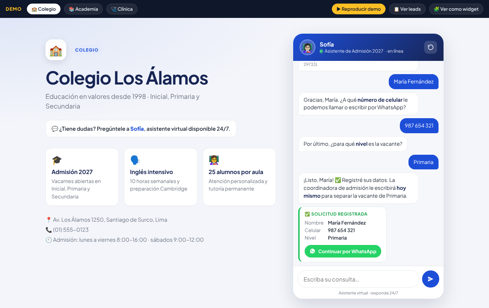
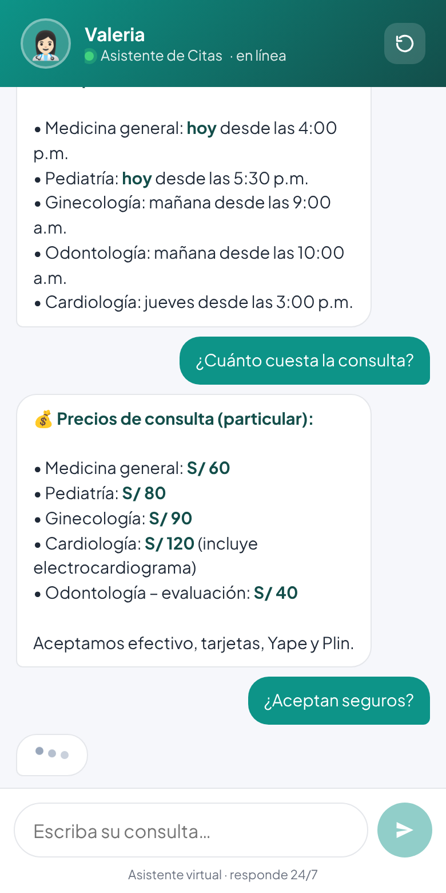
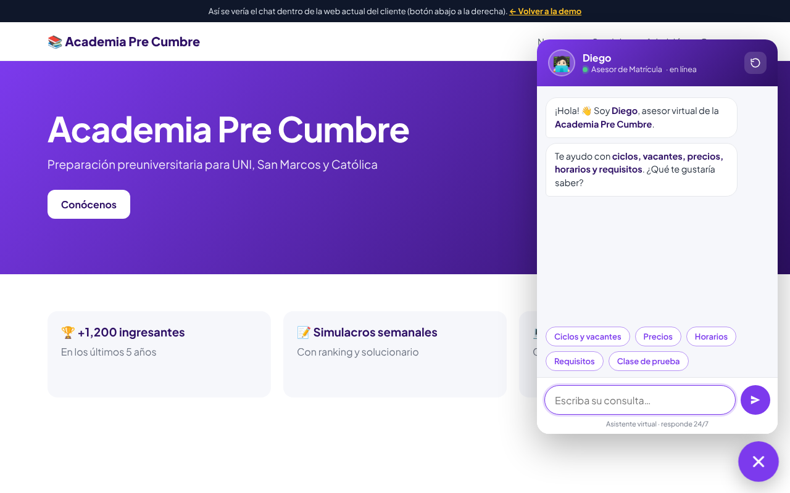

# 💬 Chat de Admisiones e Informes

Una página web con un **asistente virtual** que responde las preguntas de siempre
(**vacantes, pensiones, horarios y requisitos**) y, al final, **pide nombre y celular**
para que el cliente pueda llamar o escribir a la persona interesada.

Sirve para **colegios, academias, institutos y clínicas**. Esta demo trae tres ejemplos listos
(con datos ficticios) para que se la muestres a tus prospectos.

| Escritorio | Celular | Dentro de la web del cliente |
|---|---|---|
|  |  |  |

---

## 1. Pruébalo en 1 minuto

No hay nada que instalar. Es HTML, CSS y JavaScript puro.

- **Opción rápida:** haz doble clic en `index.html` y se abre en tu navegador.
- **Opción recomendada** (igual a como funcionará publicado):
  ```bash
  python3 -m http.server 8080
  # y abre http://localhost:8080
  ```

En la barra negra de arriba puedes cambiar entre **Colegio / Academia / Clínica**,
presionar **▶ Reproducir demo**, ver los **leads** registrados o verlo **como widget**.

### Enlaces útiles (parámetros de la URL)

| URL | Qué hace |
|---|---|
| `index.html?cliente=academia` | Carga otro cliente (`colegio`, `academia`, `clinica`) |
| `index.html?demo=1` | Reproduce sola la conversación de ~30 s (para grabar el video) |
| `index.html?demo=1&ritmo=1.5` | La misma demo, más lenta (para que se lea mejor) |
| `index.html?modo=widget` | Solo el chat a pantalla completa (ideal para grabar en vertical) |
| `index.html?limpio=1` | Oculta la barra negra de la demo |
| `leads.html` | Tabla con los contactos registrados en este navegador + descarga a Excel |
| `ejemplo-widget.html` | Simula la web del cliente con el botón de chat flotante |

---

## 2. Cómo está hecho

```
index.html             Página: datos de la institución + el chat
css/estilos.css        Diseño (colores del cliente vía variables CSS)
js/configs/*.js        ⭐ LOS DATOS DE CADA CLIENTE (lo único que cambias por cliente)
js/bot.js              Motor del chat: entiende la pregunta y arma la respuesta
js/app.js              Interfaz: burbujas, "escribiendo…", botones, demo automática, guardar leads
js/widget.js           Botón flotante para pegar el chat en cualquier web
leads.html             Tabla de leads + exportar CSV
ejemplo-widget.html    Página de muestra con el widget
tests/bot.test.js      Pruebas automáticas del motor
docs/                  Guías: vender, grabar el video, conectar Google Sheets
```

### El motor (js/bot.js) en palabras simples

1. **Normaliza** lo que escribe la persona: minúsculas, sin tildes ni signos.
   `"¿Cuánto es la PENSIÓN?"` → `"cuanto es la pension"`.
2. **Busca palabras clave** de cada tema (intención) definidas en la configuración.
   Cada coincidencia suma 2 puntos; las palabras ambiguas (marcadas con `~`, como `~cuanto`) suman 1.
   Las claves se buscan al inicio de palabra, así `pension` encuentra "pensiones".
3. **Responde el tema con más puntos.** Si la pregunta toca dos temas
   ("¿qué requisitos piden y el horario?") responde ambos.
   Saludos y "gracias" solo cuentan si no hay otro tema.
4. Si no entiende, da una respuesta de respaldo con los temas que sí sabe; si no entiende dos veces seguidas,
   ofrece que una persona le llame.
5. **Captura del lead** (una pequeña máquina de estados):
   `chat → nombre → celular → pregunta extra (nivel/especialidad) → registrado`
   - Se ofrece después de **3 preguntas respondidas** (`lead.despuesDe`), cuando dice "gracias",
     o al instante si escribe "quiero inscribirme", "agendar visita", "que me llamen", etc.
   - Valida el nombre (solo letras; acepta "me llamo…") y el celular peruano
     (9 dígitos que empiezan con 9; acepta `+51 987 654 321`).
   - Si en medio pregunta algo ("¿y la matrícula?"), le responde y vuelve a pedir el dato.
   - Siempre puede salir con **"Ahora no"**.
   - Muestra el texto de **consentimiento** (Ley N.° 29733) antes de pedir datos.

**¿Por qué sin inteligencia artificial?** Para una demo y para clientes pequeños es lo mejor:
costo $0 por mensaje, nunca inventa precios ni datos, responde al instante, funciona en cualquier
hosting gratuito y no expone ninguna clave. Ver la sección 8 para la versión con IA.

### Qué pasa con los datos (los "leads")

Cuando alguien deja su nombre y celular:

1. Se muestra la tarjeta **"Solicitud registrada"** y, si configuraste `whatsapp`,
   un botón **"Continuar por WhatsApp"** que abre el WhatsApp del colegio con el mensaje ya escrito.
2. Se guarda en el navegador (lo ves en `leads.html`). **Esto es solo para la demo**:
   cada navegador tiene sus propios datos.
3. Si configuraste `webhookUrl`, se envía a una **hoja de Google Sheets** del cliente
   (gratis, ver [docs/GOOGLE-SHEETS.md](docs/GOOGLE-SHEETS.md)). **Esto es lo que usas con clientes reales.**

---

## 3. Personalizarlo para un cliente nuevo (≈ 30–60 min)

1. Copia `js/configs/colegio.js` (o el que más se parezca) como `js/configs/colegio-san-jose.js`.
2. Cambia la última parte de la primera línea y el `id`:
   ```js
   (globalThis.CONFIGS = globalThis.CONFIGS || {})['colegio-san-jose'] = {
     id: 'colegio-san-jose',
   ```
3. Reemplaza: nombre, eslogan, colores (los del logo del cliente), nombre del asistente, destacados,
   contacto y **las respuestas** con sus datos reales (vacantes, pensiones, horarios, requisitos…).
4. Pon el número de WhatsApp en `whatsapp: '51987654321'` (código de país + número).
5. Agrega el archivo en `index.html` (y en `leads.html` / `ejemplo-widget.html` si los usas):
   ```html
   <script src="js/configs/colegio-san-jose.js"></script>
   ```
6. Ábrelo con `?cliente=colegio-san-jose` y **prueba escribiendo como lo haría un padre**:
   con faltas, sin tildes, todo junto ("cuanto sale la pension de 1er grado").
   Si algo no lo entiende, agrega esa palabra a `palabras` del tema correspondiente.
7. Ajusta el guion `demo` para el video.
8. Corre las pruebas: `node tests/bot.test.js` (verifican que cada sugerencia tenga respuesta
   y que la demo termine registrando el lead).

**Para entregar la web al cliente**, deja en `index.html` solo el `<script>` de su configuración:
la barra negra de DEMO desaparece sola y se carga su chat directamente.

> Tip: las fuentes donde sacar los datos son su página de Facebook, su web, sus respuestas
> fijadas en WhatsApp Business y, sobre todo, preguntarle a la secretaria
> **"¿qué 10 preguntas le hacen todos los días?"**.

---

## 4. Publicarlo gratis

👉 **Primera vez? Sigue la guía paso a paso: [docs/PUBLICAR-Y-ENTREGAR.md](docs/PUBLICAR-Y-ENTREGAR.md)**
(publicar, editar desde el navegador, crear el chat de cada cliente y qué entregarle).

Cualquier hosting de páginas estáticas sirve:

- **GitHub Pages:** en el repositorio → *Settings → Pages → Deploy from a branch* → rama `main`, carpeta `/ (root)`.
  Queda en `https://TU-USUARIO.github.io/ChatDeAdmisiones/`.
- **Netlify Drop:** entra a `app.netlify.com/drop` y arrastra la carpeta. Te da un link en segundos.
- **Vercel / Cloudflare Pages:** conecta el repositorio y listo (sin configuración).

Para cada cliente real conviene **un sitio aparte** (o un subdominio, ej. `admision.colegiosanjose.edu.pe`).

## 5. Instalarlo en la web que el cliente ya tiene

Pega esta línea antes de `</body>` en su web (WordPress, Wix con código, HTML, etc.):

```html
<script src="https://TU-SITIO/js/widget.js" data-cliente="colegio-san-jose"
        data-color="#1d4ed8" data-saludo="¿Consultas sobre la admisión 2027? 👋" defer></script>
```

Aparece un botón de chat flotante abajo a la derecha (mira `ejemplo-widget.html`).
También puedes poner el enlace directo del chat en su **bio de Instagram, Facebook o Google Maps**.

---

## 6. Grabar el video de 30 segundos

Guion, configuración y pasos detallados en **[docs/GUION-VIDEO.md](docs/GUION-VIDEO.md)**.
Resumen: abre `index.html?demo=1` (horizontal) o `index.html?modo=widget&demo=1` en modo celular,
empieza a grabar y la conversación se escribe sola en ~30 s.

## 7. Cómo venderlo

Guía completa (a quién, qué decir, precios de referencia, objeciones, aspectos legales y checklist de
entrega) en **[docs/GUIA-VENTA.md](docs/GUIA-VENTA.md)**.

---

## 8. Limitaciones y siguiente nivel

- Entiende por **palabras clave**: responde muy bien a las preguntas frecuentes, pero no "conversa" de
  cualquier tema. Para el 90 % de consultas de admisión es suficiente, y es 100 % predecible.
- Los leads de `leads.html` viven en un solo navegador: para clientes reales usa Google Sheets y/o WhatsApp.
- **Versión con IA (plan premium):** se puede conectar un modelo de lenguaje (por ejemplo, Claude de
  Anthropic) que reciba como contexto la misma información de la configuración y responda con más
  naturalidad. Requiere un pequeño backend (ej. Cloudflare Workers o Vercel Functions) porque
  **la clave de la API nunca debe ir en el código de la página**, y tiene costo por uso.
  Ofrécelo como mejora, no como punto de partida.
- **No es un bot oficial de WhatsApp.** Lleva a la persona al WhatsApp del cliente con el mensaje listo.
  Un bot dentro de WhatsApp requiere la API de WhatsApp Business (Meta), con costos y aprobación aparte.

## Pruebas

```bash
node tests/bot.test.js
```
